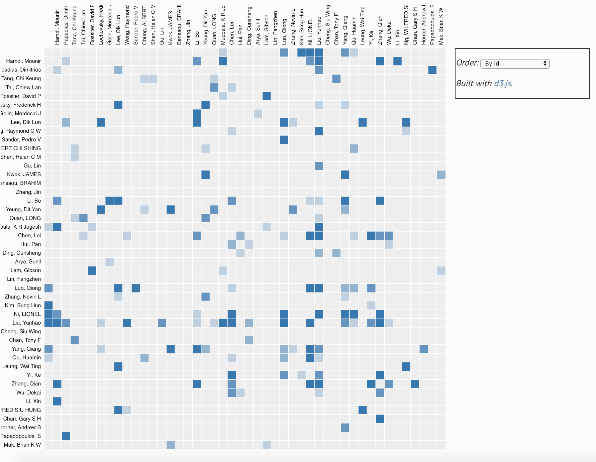
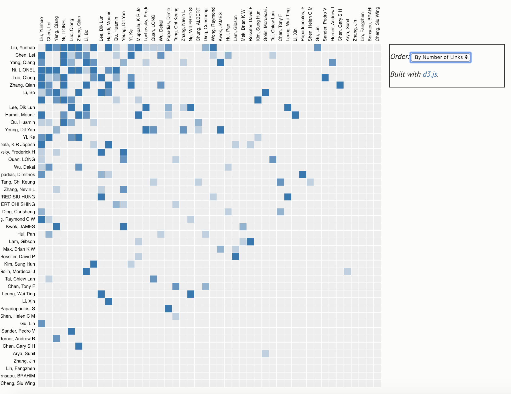
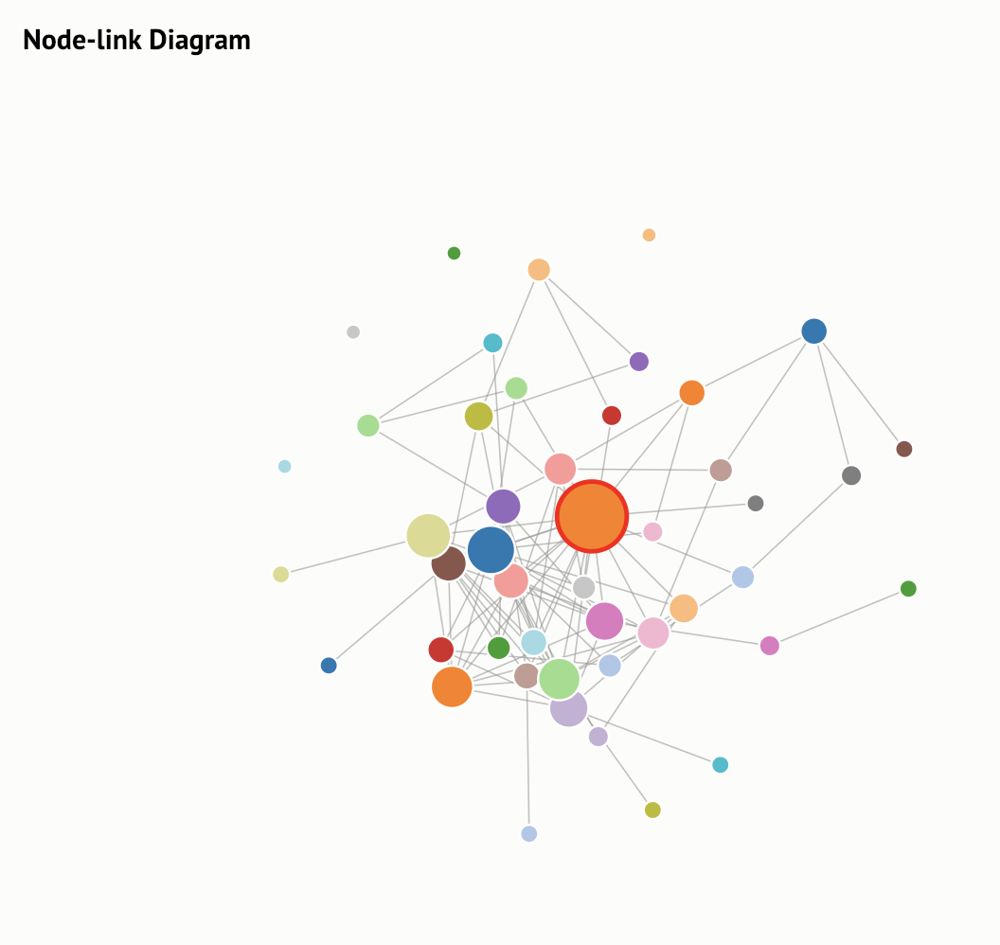
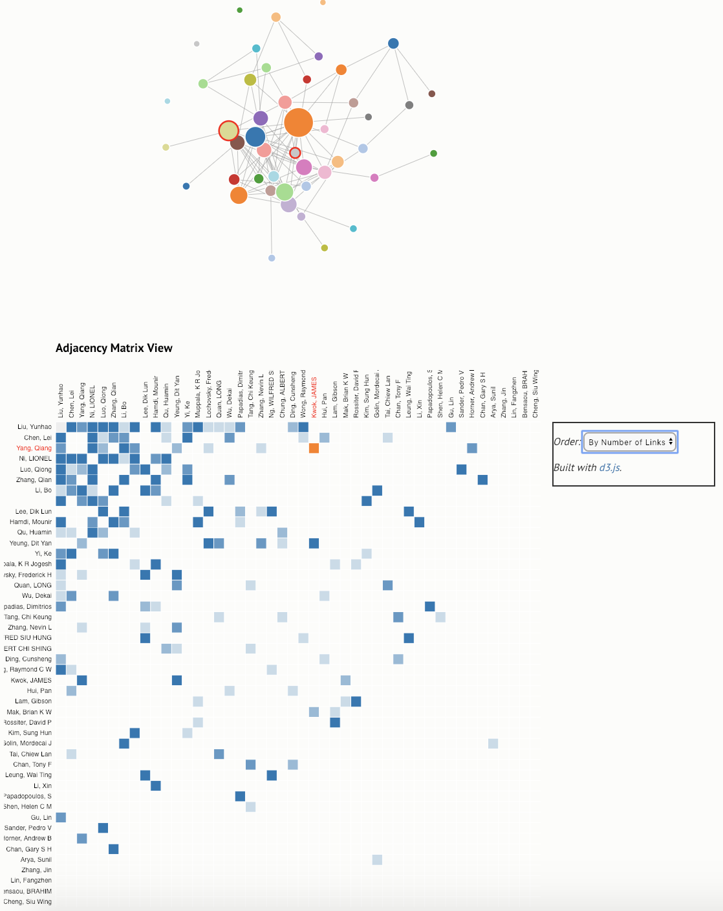
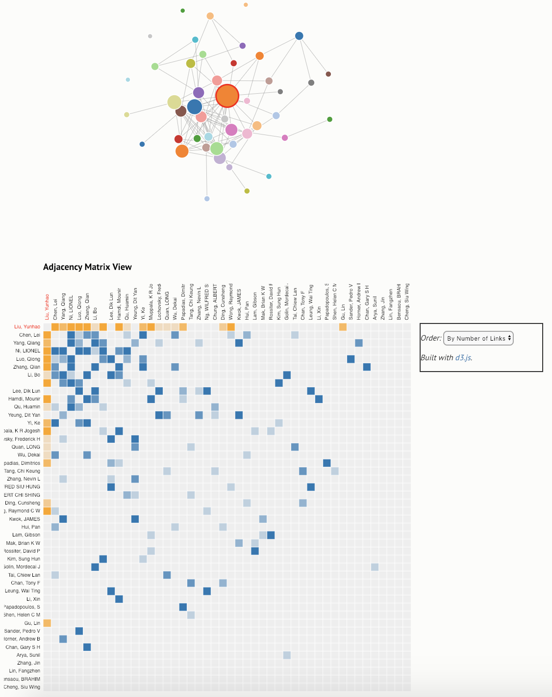

### level 3

In this level, HKUST CSE coauthor graph is constructed and visualized. Node-link diagram and adjacency matrix are applied and interactions between them are added, as well as some animations (sorting, grouping, etc).

 The preview of the visualization result can be seen below:

- Matrix view (sorted by *id*)

- Matrix view (sorted by *# of links*)

- Node-link Diagram (highlighted by selection)

- Interaction view
  - From *matrix2node*

  

  - From *node2matrix*

  

(--- fix author issue ---)