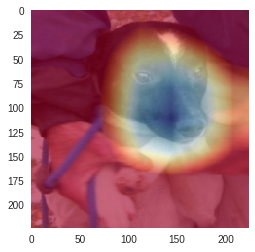
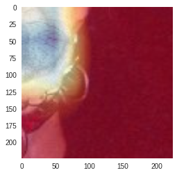
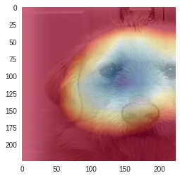
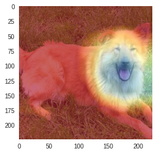

### LEVEL 5 Dogs V.S. Cat

- In terms of limits of time and devices, 

  - I choose to use [*dog-cat dataset*](https://www.kaggle.com/c/dogs-vs-cats-redux-kernels-edition/data), instead of *Google-landmark-recognition* dataset. Furthermore, the result is visualized using [*CAM*](http://cnnlocalization.csail.mit.edu/) model.
  - I am new to Pytorch, thus this is a new challenge for me to get familiar with the framework and finish hands-on practice. I used current model for finetuing and evaluation (<u>resnet101</u>)

- The expereiment was conducted in [Colaboratory, Google](https://colab.research.google.com/notebooks/welcome.ipynb)
  The detail about code can be found at [**link**](
  https://colab.research.google.com/drive/1V4Jx49rmKI04skBhKO786zf1EvrbZDeJ)

- The visualization results can be seen below:

  

  

  

  
